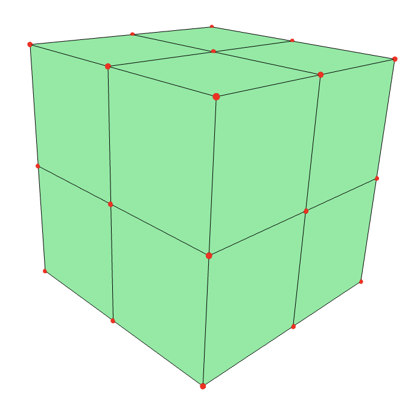

# Visualising 2 and 3-dimensional bisection fans
This repo contains a Jupyter notebook and execute polymake code (the .pl files) for visualising 2 and 3-dimensional bisection fans. 

### Installation
Install polymake on your machine as detailed [here](https://polymake.org/doku.php/download/start). If you're using a Windows machine, the best way to install it is to do so on WSL2. Instructions are [here](https://docs.google.com/document/d/1pJm5Shye_7nwL4tEx695frccYMfbXHYSpKEHJ_HHEt0/edit). To be able to run the Jupyter notebook containing polymake commands, add the polymake kernel to your Jupyter set-up as outlined [here](https://polymake.org/doku.php/user_guide/howto/jupyter).

### Ways of executing the polymake code
Clone the repository using `git clone git@github.com:AryamanJal/Bisection_fan.git`.

1) Executing from the terminal:  `cd` into `Bisection_fan` and open polymake with `polymake`. Choose your favourite $2$ or $3$-dimensional, centrally symmetric polytope $P$ and save it to some variable `$p`. For example `$p=cube(3);`. Then run
```
script("./write_vertices.pl"); 
write_vert($p);
```

This writes the vertices of $P$ to `vertices.txt`. Now run `script("./plot.pl");`. If everything has been installed correctly, a browser window should open up where the collection of all the bisection cones of $P$ are visualised simultaneously. The bisection fan of the cube for example will look like the image below.



2) Execute from the Jupyter notebook: Instructions in the `Visualising bisection fans.ipynb` are self-explanatory.

### Other aspects

The cone $\mathcal{B}_{F, G}$ was computed from its inequality description, a derivation of which is done in the `Inequality_description_of_bisection_cones.pdf`

The file `check_equality.pl` verifies the proposition in the paper that states that if $F, G$ are facets of the polytope $P$ then $\mathcal{B}_{F, G} = \text{cone}(\{v  - u : v \in \text{vert}(F), u \in \text{vert}(G)\}).$

